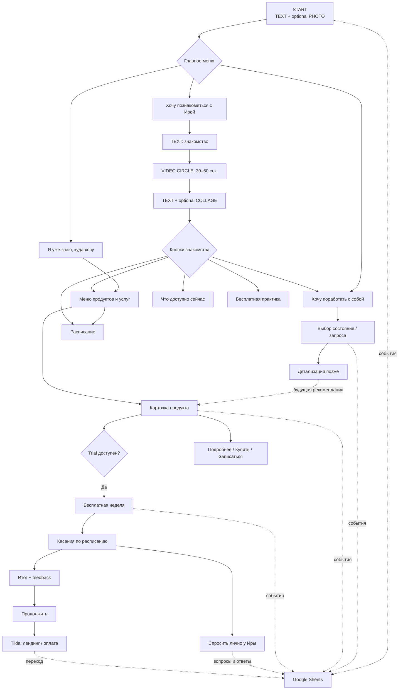

# Telegram-бот Иры — полная спецификация

**Статус:** единый рабочий документ для разработки  
**Назначение:** собрать в одном месте пользовательские flow, продукты, бесплатные недели, вопросы Ире, переходы на Tilda и сбор данных в Google Sheets  
**Язык интерфейса:** русский  
**Все неподтверждённые тексты, названия, материалы, цены и ссылки:** `TBD`

> Бот не заменяет Иру и не проводит терапию. Его задача: помочь человеку сориентироваться, познакомиться с подходом, выбрать формат, попробовать материалы и при желании перейти к продолжению.

## 1. Цели и принципы

### Цели

1. Познакомить нового человека с Ирой.
2. Дать быстрый доступ к конкретному продукту тем, кто уже знает, куда хочет.
3. Помочь сориентироваться человеку, который пока не знает, что выбрать.
4. Предложить бесплатную неделю для трёх практикумов.
5. Дать возможность задать вопрос лично Ире.
6. Показать актуальные предложения и расписание.
7. Сохранить путь каждого пользователя и показать воронку в Google Sheets.
8. Перевести готового продолжать человека на соответствующий лендинг Tilda.

### Принципы

- Короткий путь без длинной анкеты.
- Мягкая коммуникация без давления.
- Максимум 1–2 уточняющих вопроса до будущей рекомендации.
- Возможность вернуться назад и в главное меню.
- Расписание, актуальные предложения и материалы trial редактируются без изменения кода.
- Неизвестные данные не придумываются и остаются `TBD`.
- `telegram_user_id` является основным идентификатором пользователя.
- CRM Tilda на первом этапе не используется для посетителей бота.
- Покупки проходят на Tilda; путь внутри бота хранится в Google Sheets.

## 2. Общая карта



ASCII-версия:

```text
START
  ├── Хочу поработать с собой
  │     └── состояние / запрос → [детализация позже]
  ├── Я уже знаю, куда хочу
  │     ├── продукт → карточка → trial / подробнее / Tilda
  │     └── расписание
  └── Хочу познакомиться с Ирой
        └── text → video circle → text/collage → выбор

Trial трёх практикумов
  └── касание 1 → касание 2 → касание 3/4
        ├── спросить лично у Иры
        └── feedback → продолжить → Tilda

Все значимые действия → Google Sheets → Users / Events / Trials /
Questions / Follow_up / Dashboard / Config
```

## 3. START

### Триггеры

- `/start`
- `/start <parameter>` для Instagram, YouTube, сайта и кампаний.
- Кнопка «Главное меню».

### Сообщения

1. `[TEXT]` Короткое приветствие — `TBD`.
2. `[PHOTO — optional]` Фото Иры — `TBD`.
3. `[INLINE BUTTONS]`:
   - Хочу поработать с собой
   - Я уже знаю, куда хочу
   - Хочу познакомиться с Ирой

Опциональная отдельная кнопка «Расписание» в главном меню: решение `TBD`.

## 4. Flow 1 — «Хочу поработать с собой»

### Текущий уровень

`[TEXT]` «Что сейчас больше всего похоже на тебя?» или финальная версия `TBD`.

`[INLINE BUTTONS]`:

- Хочу больше чувствовать жизнь и себя
- Я многое могу, но всё через напряжение
- В моей жизни повторяется болезненная ситуация
- Хочу регулярно быть в контакте с собой
- Хочу сама разобраться с конкретной ситуацией
- Хочу работать с собой через карты
- Не знаю, что выбрать
- ← Назад
- 🏠 Главное меню

### Ограничение текущего этапа

Ветка фиксируется только на верхнем уровне. Соответствие запросов продуктам, дополнительные вопросы и рекомендации разрабатываются позже.

Предполагаемая будущая логика:

```text
выбор состояния
→ 1–2 уточняющих вопроса
→ рекомендация
→ карточка продукта
```

До утверждения таблицы соответствий бот не должен автоматически назначать продукт. Выбранное состояние сохраняется в Google Sheets.

## 5. Flow 2 — «Я уже знаю, куда хочу»

### Вход

`[TEXT]` Короткое приглашение выбрать продукт, услугу или расписание — `TBD`.

### Меню

1. Маршрут построен
2. Вкус жизни
3. Я всё могу
4. Карты Иры — точное название `TBD`
5. Алхимия Реальности
6. Зазеркалье
7. Бесплатная медитация тела
8. Личная консультация
9. Быстрая диагностика
10. Расписание
11. ← Назад
12. 🏠 Главное меню

Каждый продукт или услуга открывает универсальную карточку. «Расписание» открывает отдельный динамический блок.

## 6. Универсальная карточка продукта

### Поля

| Поле | Содержание |
|---|---|
| `product_id` | Стабильный внутренний ID |
| `title` | Название |
| `cover` | Фото или Telegram `file_id`, опционально |
| `short_description` | Что это, для кого и результат |
| `format` | Формат — `TBD`, если не подтверждён |
| `duration` | Продолжительность — `TBD` |
| `price` | Стоимость и валюта — `TBD` |
| `details_url` | Подробнее — `TBD` |
| `purchase_url` | Лендинг/оплата Tilda — `TBD` |
| `trial_enabled` | Доступна ли бесплатная неделя |
| `trial_flow_id` | Идентификатор trial-цепочки |
| `active` | Показывать ли продукт |

### Порядок

```text
[PHOTO / COVER — optional]
↓
[TEXT]
Название
Короткое описание
Для кого / с каким запросом
Что человек получит
Формат / длительность / стоимость — если подтверждены
↓
[BUTTONS — динамические]
Попробовать бесплатно      [если trial_enabled]
Присоединиться / Купить    [если URL задан]
Подробнее                  [если есть материал]
Задать вопрос              [если канал утверждён]
← Все продукты
🏠 Главное меню
```

Незаполненные поля и кнопки не показываются пользователю как `TBD`, а скрываются.

Для консультации и диагностики CTA может быть «Записаться» с `booking_url: TBD`.

## 7. Динамический блок «Расписание»

Доступен из Flow 2, Flow 3 и, возможно, главного меню.

```text
[TEXT] Что сейчас происходит у Иры
↓
[EVENT CARD 1...N]
Дата / период
Название
Короткое описание
Подробнее / Присоединиться
↓
[BUTTONS]
Все продукты
🏠 Главное меню
```

Поля события:

- `event_id`
- `title`
- `start_at`, `end_at`
- `short_description`
- `cover`
- `details_url`
- `join_url`
- `product_id`
- `status`: upcoming / open / ongoing / closed / archived
- `sort_order`

Расписание обновляется без изменения основного flow. Закрытые и архивные события не показываются.

## 8. Flow 3 — «Хочу познакомиться с Ирой»

Линейная последовательность без диагностики в начале:

1. `[TEXT]` Короткое знакомство: кто Ира, с чем работает и в чём её подход — `TBD`.
2. `[VIDEO CIRCLE]` Видео Иры 30–60 секунд.
3. `[TEXT + optional PHOTO/COLLAGE]` Коротко о продуктах, практиках, картах, личной работе и бесплатных материалах.
4. `[TEXT — optional]` Возможность сначала попробовать бесплатный формат.
5. `[INLINE BUTTONS]`:
   - Что доступно сейчас
   - Посмотреть расписание
   - Посмотреть все продукты
   - Хочу поработать с собой
   - Бесплатная практика
   - ← Назад
   - 🏠 Главное меню

Видео содержит:

- личное приветствие;
- с чем работает Ира;
- одну фразу о подходе;
- приглашение посмотреть форматы.

Медиафайл/Telegram `file_id`: `TBD`.

## 9. Динамический блок «Что доступно сейчас»

```text
[TEXT] Сейчас у Иры можно:
↓
[CARD] Сейчас идёт / открыт набор
[CARD] Можно попробовать бесплатно
[CARD] Скоро
↓
[BUTTONS]
Расписание
Все продукты
🏠 Главное меню
```

Показываются только непустые категории.

Поля элемента:

- `offer_id`
- `category`: open_now / free / coming_soon
- `title`
- `short_description`
- `cover`
- `product_id` или `event_id`
- `cta_label`
- `cta_url` или `target_flow`
- `active_from`, `active_until`
- `active`, `sort_order`

## 10. Типы сообщений

| Тип | Использование |
|---|---|
| `TEXT` | Приветствия, описания, вопросы, инструкции |
| `PHOTO` | START, карточки, события |
| `COLLAGE` | Обзор продуктов в Flow 3 |
| `VIDEO CIRCLE` | Личное знакомство с Ирой |
| `VIDEO` | Материалы бесплатной недели |
| `AUDIO` | Практики, задания, медитации |
| `WEBINAR LINK` | Вебинар во время trial |
| `IMAGE` | Иллюстрация или задание |
| `INLINE BUTTONS` | Навигация и действия |
| `PRODUCT CARD` | Описание продукта |
| `EVENT CARD` | Расписание |
| `DYNAMIC BLOCK` | Расписание и актуальные предложения |
| `EXTERNAL LINK` | Tilda, оплата, запись, материалы |
| `TAG / EVENT` | Аналитика, не показывается человеку |

## 11. Навигация

- «← Назад» возвращает на предыдущий логический экран.
- «🏠 Главное меню» доступно из всех основных веток, карточек и динамических блоков.
- `/start` повторно открывает главное меню, не стирая первоначальный источник.
- При устаревшей кнопке бот показывает безопасное сообщение `TBD` и кнопку главного меню.
- Пользователь может остановить автоматическую trial-цепочку через кнопку/команду `TBD`.

## 12. Deep links

Формат:

```text
https://t.me/<bot_username>?start=<parameter>
```

Примеры параметров:

- `src_ig`
- `src_yt`
- `src_site`
- `product_<product_id>`
- `campaign_<campaign_id>`

Требования:

- сохранять исходный параметр;
- разбирать source, campaign и product;
- продуктовая ссылка может сразу открыть карточку продукта;
- главное меню остаётся доступным;
- персональные данные в deep link не передаются.

## 13. Бесплатные недели: продукты

Бесплатная неделя предусмотрена для трёх практикумов:

1. **Я всё могу** — `product_id: ya_vse_mogu`
2. **Маршрут / Маршрут построен** — публичное название `TBD`, технический ID `marshrut`
3. **Вкус жизни** — `product_id: vkus_zhizni`

Для всех используется один механизм расписания, но разные материалы, тексты и Tilda-ссылки.

## 14. Расписание бесплатной недели

Отсчёт начинается индивидуально с момента входа пользователя.

Базовый вариант:

| Момент | Содержание |
|---|---|
| День 0, сразу | Приветствие и первый материал |
| День 3 | Второй материал и короткий check-in |
| День 6 | Третий материал и рефлексия |
| День 7 | Итог, feedback и предложение продолжить |

Допустим вариант с четырьмя материалами: дни 0, 2, 4 и 6 плюс итог на день 7. Финальное расписание каждого практикума: `TBD`.

Материал может быть любым:

- ссылка на вебинар;
- видео;
- аудио;
- текст;
- изображение;
- практическое задание;
- сочетание форматов.

«Раз в три дня» означает индивидуальное относительное расписание:

```text
старт 1 октября в 15:00
→ касание 1: сразу
→ касание 2: 4 октября
→ касание 3: 7 октября
→ итог: 8 октября
```

Допустимые часы отправки и часовой пояс: `TBD`.

## 15. Шаблон касания бесплатной недели

```text
[TEXT] Короткое введение
↓
[CONTENT]
webinar / video / audio / text / image / task
↓
[OPTIONAL BUTTONS]
Посмотрела / Сделала
Вернусь позже
Появился вопрос
↓
[BUTTON]
Спросить лично у Иры
```

Кнопка «Спросить лично у Иры» присутствует под каждым касанием и в меню активного trial.

Отслеживаются:

- факт отправки;
- ошибка доставки, если доступна;
- нажатие на отслеживаемую ссылку;
- отметка «Посмотрела» / «Сделала»;
- check-in;
- заданный вопрос.

Сам факт прочтения обычного Telegram-сообщения нельзя считать надёжно измеренным.

## 16. Цепочки трёх практикумов

### «Я всё могу»

```text
День 0: материал 1 — TBD
День 3: материал 2 — TBD
День 6: материал 3 — TBD
День 7: feedback + продолжение + Tilda
```

### «Маршрут» / «Маршрут построен»

```text
День 0: материал 1 — TBD
День 3: материал 2 — TBD
День 6: материал 3 — TBD
День 7: feedback + продолжение + Tilda
```

### «Вкус жизни»

```text
День 0: материал 1 — TBD
День 3: материал 2 — TBD
День 6: материал 3 — TBD
День 7: feedback + продолжение + Tilda
```

Для каждого касания в настройках хранятся:

- версия цепочки;
- задержка от старта;
- правило времени;
- вводный текст;
- тип контента;
- файл/Telegram `file_id`/URL;
- check-in-кнопки;
- статус активности.

## 17. «Спросить лично у Иры»

### Пользовательский flow

```text
[BUTTON] Спросить лично у Иры
↓
[TEXT] Напиши свой вопрос одним сообщением — финальный текст TBD
↓
[USER MESSAGE]
↓
[TEXT] Подтверждение получения + ориентир ответа — TBD
```

Следующее сообщение связывается с пользователем, продуктом, trial и номером касания.

Доступны кнопки:

- Отменить вопрос
- 🏠 Главное меню

### Доставка Ире

Бот отправляет вопрос в приватный служебный Telegram-чат Иры или закрытую группу:

```text
Новый вопрос из бесплатной недели

Имя: <first_name>
Username: @username или «не указан»
Telegram ID: <id>
Практикум: <product>
Касание: <number>
Trial начат: <date>

Вопрос:
<question_text>

[Ответить через бота]
[Открыть карточку в таблице]
[Отметить решённым]
```

`admin_chat_id`: `TBD`. Ира должна предварительно запустить бота или состоять в служебной группе.

### Ответ

1. Ира нажимает «Ответить через бота».
2. Отправляет текст, voice, video или поддерживаемый материал.
3. Получает предпросмотр.
4. Подтверждает отправку.
5. Бот отвечает пользователю по `telegram_user_id`.
6. Вопрос получает статус `answered`.

Так Ира может ответить, даже если у человека нет username.

## 18. Финал бесплатной недели

```text
[TEXT]
Поддерживающее признание пройденного пути
Приглашение заметить изменения
↓
[QUESTION] Что удалось попробовать?
[BUTTONS]
Прошла всё
Попробовала часть
Пока только познакомилась
↓
[QUESTION] Что замечаешь сейчас?
[BUTTONS]
Уже чувствую изменения
Хочу пойти глубже
Появился вопрос
Пока присматриваюсь
↓
[OPTIONAL FREE TEXT]
Можно написать несколько слов — текст TBD
↓
[QUESTION] Хочешь продолжить полный практикум?
[BUTTONS]
Да, хочу пройти дальше
Сначала узнать подробнее
Спросить лично у Иры
Пока не готова
🏠 Главное меню
```

Маршрутизация:

- «Да, хочу пройти дальше» → Tilda лендинг/оплата.
- «Сначала узнать подробнее» → карточка или Tilda лендинг.
- «Спросить лично у Иры» → служебная ветка вопросов.
- «Пока не готова» → мягкое завершение, статус сохраняется.

## 19. Переход на Tilda

Для каждого продукта:

- `landing_url: TBD`
- `payment_url: TBD`
- UTM-параметры;
- безопасный внутренний reference-код.

Пример структуры:

```text
https://<tilda-domain>/<product-page>
?utm_source=telegram_bot
&utm_medium=trial
&utm_campaign=<product_id>
&utm_content=trial_completed
&bot_ref=<non_personal_reference>
```

Правила:

- открытый Telegram ID, username и телефон не передаются в URL;
- `purchase_clicked` фиксируется до открытия Tilda;
- на первом этапе подтверждение покупки можно отмечать вручную;
- в будущем покупка связывается с пользователем по безопасному `bot_ref` или другому согласованному ID.

## 20. Планировщик trial

- Каждая отправка имеет уникальный ключ `trial_id + touch_number`.
- Повторный запуск задачи не дублирует сообщение.
- Перед отправкой проверяется статус trial.
- При временной ошибке возможен ограниченный повтор.
- Если пользователь заблокировал бота, trial получает статус `unreachable`.
- После завершения материалы не отправляются повторно.
- Пользователь может остановить цепочку.
- Учитываются тихие часы.
- Изменение настроек не должно дублировать старые касания.
- Рекомендуется сохранять версию цепочки на момент старта пользователя.

## 21. Решение по данным

На первом этапе используется один общий Google Sheets-файл с совместным доступом Иры и команды.

Tilda CRM не используется для посетителей Telegram-бота. Tilda продолжает принимать покупки на сайте.

Google Sheets содержит семь вкладок:

1. `Users`
2. `Events`
3. `Trials`
4. `Questions`
5. `Follow_up`
6. `Dashboard`
7. `Config`

## 22. Вкладка `Users`

Одна строка — один человек. Повторный вход обновляет строку.

| Колонка | Содержание |
|---|---|
| `telegram_user_id` | Главный уникальный ID |
| `first_name`, `last_name` | Имя и фамилия |
| `username` | Может отсутствовать или измениться |
| `phone` | Только после добровольной передачи |
| `first_seen_at` | Первый вход |
| `last_activity_at` | Последняя активность |
| `entry_source` | Instagram / YouTube / site / direct |
| `entry_campaign` | Кампания/публикация |
| `start_parameter_raw` | Исходный start-параметр |
| `first_flow`, `current_flow` | Первая и текущая ветка |
| `current_stage`, `stage_number` | Где находится пользователь |
| `last_event` | Последнее действие |
| `last_product_id` | Последний продукт |
| `interested_products` | Все интересы |
| `active_trial_id` | Активная неделя |
| `trials_started_count` | Начатые trial |
| `trials_completed_count` | Завершённые trial |
| `trial_products` | Пройденные продукты |
| `purchase_click_count` | Переходы на Tilda |
| `purchase_status` | unknown / clicked / confirmed / not_purchased |
| `lead_temperature` | cold / warm / hot |
| `personal_follow_up` | yes / no |
| `follow_up_reason` | Причина внимания |
| `manager_status` | new / planned / contacted / replied / closed |
| `manager_comment` | Ручная заметка |
| `next_contact_at` | Следующий контакт |
| `updated_at` | Обновление строки |

Полезные фильтры:

- завершили trial без покупки;
- прошли два или больше trial;
- задали вопрос Ире;
- несколько раз открывали продукт;
- нажали переход к покупке;
- неактивны 3 или 7 дней;
- требуют ответа;
- отмечены для личного внимания.

## 23. Вкладка `Events`

Одна строка — одно действие; история не перезаписывается.

Колонки:

- `event_id`, `occurred_at`, `telegram_user_id`;
- `event_name`, `flow_id`, `stage_id`, `stage_number`;
- `product_id`, `trial_id`, `touch_number`;
- `content_type`, `button_id`;
- `source`, `campaign`, `metadata`.

Основные события:

```text
bot_started
flow_selected
product_viewed
trial_offer_viewed
trial_started
trial_touch_sent
trial_content_clicked
trial_feedback_answered
ask_ira_clicked
question_submitted
ira_reply_sent
trial_completed
continuation_offer_viewed
continue_clicked
purchase_clicked
purchase_confirmed
back_clicked
home_clicked
bot_blocked_or_unreachable
```

## 24. Вкладка `Trials`

Одна строка — одна бесплатная неделя конкретного пользователя.

Основные поля:

- `trial_id`, `telegram_user_id`, `product_id`;
- `started_at`, `scheduled_end_at`, `completed_at`;
- `status`: scheduled / active / completed / cancelled / unreachable;
- `current_touch`;
- время отправки и клика для каждого касания;
- `feedback_status`, `feedback_answer`, `feedback_text`;
- `asked_ira`;
- `continuation_clicked`;
- `purchase_clicked_at`, `purchase_status`.

## 25. Вкладка `Questions`

Одна строка — один вопрос.

Поля:

- `question_id`, `created_at`, `telegram_user_id`, `username`;
- `product_id`, `trial_id`, `touch_number`;
- `question_text`;
- `status`: new / in_progress / answered / closed;
- `ira_telegram_message_id`, `assigned_to`;
- `answer_text`, `answered_at`.

## 26. Вкладка `Follow_up`

Рабочий список людей, которым нужно ответить или уместно уделить внимание.

| Поле | Содержание |
|---|---|
| Приоритет | Высокий / средний / низкий |
| Пользователь | Имя и username |
| Причина | Например, завершил два trial |
| Продукт | Интересующий формат |
| Рекомендуемое действие | Ответить / предложить следующий шаг |
| Инициатива/согласие | Задал вопрос / попросил рекомендацию / нет |
| Последняя активность | Дата |
| Ответственный | Ира / менеджер |
| Статус | Новый / запланирован / написали / ответил / закрыт |
| Комментарий | Ручная заметка |

Автоматические основания:

- новый личный вопрос;
- запрос продолжения;
- два или больше trial без покупки;
- несколько просмотров продукта;
- интерес к консультации;
- переход на Tilda без подтверждённой покупки;
- feedback с выраженным интересом.

Это подсказка команде, а не автоматическая рассылка от личного аккаунта Иры.

## 27. Вкладка `Dashboard`

Дашборд создаётся внутри Google Sheets с помощью формул, сводных таблиц и диаграмм.

### Периоды

- сегодня;
- вчера;
- последние 7 дней;
- текущий месяц;
- предыдущий месяц;
- произвольный диапазон.

### Основная воронка

| Показатель | Количество | Процент от вошедших |
|---|---:|---:|
| Новые пользователи | авто | 100% |
| Выбрали путь | авто | авто |
| Открыли продукт | авто | авто |
| Увидели предложение trial | авто | авто |
| Начали trial | авто | авто |
| Получили второе касание | авто | авто |
| Завершили trial | авто | авто |
| Ответили на feedback | авто | авто |
| Нажали «Пройти дальше» | авто | авто |
| Перешли на Tilda | авто | авто |
| Покупка подтверждена | вручную/интеграцией | авто |

Дополнительные блоки:

- пользователи по дням;
- источники и кампании;
- выбор основных веток;
- конверсия по продуктам;
- отдельная воронка каждого практикума;
- переходы между касаниями;
- места остановки;
- вопросы Ире и время ответа;
- follow-up по причинам и приоритетам;
- переходы на Tilda.

### Статусы активности

- `active` — действие менее 24 часов назад;
- `paused` — без продолжения 24–72 часа;
- `stopped` — без продолжения более 72 часов;
- `inactive` — без активности более 7 дней;
- `completed` — ветка/trial завершены.

Интервалы редактируются в `Config`.

## 28. Вкладка `Config`

Редактируемые настройки:

- продукты и ID;
- видимость и порядок продуктов;
- расписание и текущие предложения;
- доступность trial;
- расписание касаний;
- тексты и типы материалов;
- Telegram `file_id` и ссылки;
- Tilda URLs и UTM;
- `admin_chat_id`;
- правила follow-up;
- интервалы неактивности;
- тихие часы;
- версии цепочек.

Секреты, включая токен бота, в Google Sheets не хранятся.

## 29. Логика «кому стоит написать»

Возможный стартовый скоринг:

| Действие | Баллы |
|---|---:|
| Открыл продукт | +1 |
| Начал trial | +3 |
| Нажал на материал | +1 |
| Отметил выполнение | +2 |
| Завершил trial | +4 |
| Прошёл ещё один trial | +3 |
| Выбрал «Хочу пойти глубже» | +5 |
| Задал вопрос Ире | +6 |
| Перешёл на Tilda | +5 |
| Неактивен более 14 дней | −2 |

Пороги определяются после появления реальных данных.

Без скоринга высокий приоритет имеют:

- вопросы Ире;
- запрос продолжения;
- запрос консультации;
- проблема с доступом или оплатой.

## 30. Доступ и защита данных

- Доступ к таблице только по приглашению.
- Публичное редактирование запрещено.
- Технические диапазоны защищены.
- Для ручного редактирования выделены отдельные колонки.
- Хранятся только необходимые данные.
- Чувствительные психологические подробности не копируются без необходимости.
- Телефон собирается только после добровольного действия.
- Личное сообщение желательно отправлять после вопроса или явной инициативы человека.
- Правила согласия, хранения и удаления данных согласуются отдельно.

## 31. Технические требования

- Стабильные внутренние ID не зависят от названий.
- Callback data валидируется и версионируется.
- Критические операции идемпотентны.
- Повторный вход не создаёт дубль пользователя.
- Каждое значимое действие добавляется в `Events`.
- Текущее состояние обновляется в `Users`.
- Google Sheets API используется через отдельную сервисную учётную запись или другой согласованный безопасный способ.
- Ошибка записи в таблицу не должна ломать диалог с пользователем; нужна очередь/повтор.
- Желательна резервная копия событий на стороне приложения бота.
- Нельзя полагаться на username для связи записей.
- Свободная AI-диагностика не входит в текущую версию.
- Хостинг, стек, оплата и автоматическое подтверждение покупки: `TBD`.

## 32. Что подготовить до разработки наполнения

1. Финальные тексты START и вводных сообщений.
2. Точные названия всех продуктов, особенно карт и «Маршрута».
3. Обложки и collage.
4. Видео-кружок 30–60 секунд.
5. Бесплатную медитацию и практику.
6. Описания, форматы, длительность и цены.
7. Ссылки «Подробнее», записи и покупки.
8. По 3–4 материала для каждого из трёх практикумов.
9. Тип каждого материала: webinar/video/audio/text/image/task.
10. Тексты, check-in-кнопки и расписание касаний.
11. Финальные вопросы feedback.
12. Tilda landing/payment URL каждого продукта.
13. Google Sheets с доступом для приложения бота.
14. Закрытый Telegram-чат для вопросов Ире.
15. Правила времени отправки и остановки trial.
16. Список источников и кампаний для deep links.
17. Способ ручного или автоматического подтверждения покупки.

## 33. Критерии готовности первой версии

- Все три главные ветки работают.
- Flow 1 остаётся на утверждённом верхнем уровне.
- Flow 2 содержит полное меню и карточки продуктов.
- Flow 3 отправляет text → video circle → text/collage → кнопки.
- Расписание и актуальные предложения редактируются отдельно.
- Trial работают для «Я всё могу», «Маршрута» и «Вкуса жизни».
- Касания отправляются индивидуально и без дублей.
- Под каждым касанием есть «Спросить лично у Иры».
- Ира получает контекст вопроса и отвечает через бота.
- После недели собирается feedback и предлагается продолжение.
- Tilda-ссылка получает UTM и безопасный reference-код.
- `Users`, `Events`, `Trials`, `Questions` обновляются автоматически.
- `Follow_up` показывает людей, которым нужно внимание.
- `Dashboard` показывает день, неделю, месяц и места потерь.
- Back/home работают во всех основных разделах.
- Все отсутствующие данные остаются `TBD`.

